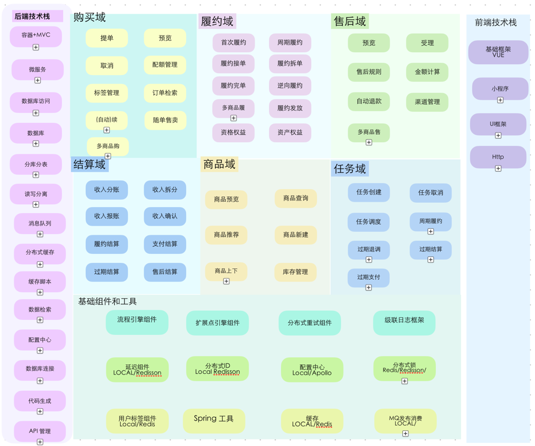

# 项目地址

Gitee：<https://gitee.com/juejinwuyang/memberclub>

GitHub  <https://github.com/juejin-wuyang/memberclub>

开源3周以来，已有140多个关注和Fork

# 简介

开源平台上有很多在线商城系统，功能很全，很完善，关注者众多，然而实际业务场景非常复杂和多样化，开源的在线商城系统很难完全匹配实际业务，广泛的痛点是

* 功能堆砌，大部分功能用不上，需要大量裁剪；

* 逻辑差异点较多，需要大量修改；

* 功能之间耦合，难以独立替换某个功能。

由于技术中间件功能诉求较为一致，使用者无需过多定制化，技术中间件开源项目以上的痛点不明显，然而电商交易等业务系统虽然通用性较多，但各行业各产品的业务差异化极大，所以导致以上痛点比较明显

所以我在思考，有没有一个开源系统，能提供电商交易的基础能力，能让开发者搭积木的方式，快速搭建一个完全契合自己业务的新系统呢？

* 他们可以通过编排和配置选择自己需要的功能，而无需在一个现成的开源系统上进行裁剪

* 他们可以轻松的新增扩展业务的差异化逻辑，不需要阅读然后修改原有的系统代码！

* 他们可以轻松的替换掉他们认为垃圾的、多余的系统组件，而不需要考虑其他功能是否会收到影响

开发者们，可以择需选择需要的能力组件，组件中差异化的部分有插件扩展点能轻松扩展。或者能支持开发者快速的重新写一个完全适合自己的新组件然后编排注册到系统中？

memberclub 就是基于这样的想法而设计的。 它的定位是电商类交易系统工具箱，
以SDK方式对外提供通用的交易能力，能让开发者像搭积木方式，从0到1，快速构建一个新的电商交易系统！

我认为这很有价值！

# 效果展示

这是五阳花了1天时间，模仿京东plus会员和抖音券包产品，借助于memberclub 提供的sdk，新搭建的一套交易系统。

使用效果如下

1. 首先购买会员类商品，提单并且模拟支付（开发者可以集成自身公司的收银支付能力）
2. 完成模拟支付后，可以在订单列表页看到购买记录，有效期和实付金额等。
3. 选择发起退款后，可以看到售后预览金额等，最终点击退款，系统回收优惠券和订单逆向。

针对优惠券卡包形式的产品业务，可以支持多商品、多份数等形式的购买，支持购物车提单。最后也展示了购买配额能力。

以上交易提单、履约、售后和结算等模块均依赖 memberclub 提供的sdk实现。


# 你的顾虑

在memberclub中，除业务组件可以自由的编排、扩展和替换之外，服务所依赖的其他中间件和基础能力也可以轻松的替换和扩展。 例如我们为
MQ、缓存、分布式锁、重试组件、延迟组件、分布式配置组件、SPI等定义类接口，使用者可以配置组件名，使用自己的组件。

所以你无需有以下顾虑

1. 我们使用的MQ 是Kafka，memberclub万一使用的MQ是 rabbitmq，这怎么办？
2. 我们有分布式ID服务，替换成本高怎么办？
3. 我们有自己的分布式锁组件，替换成本高怎么办？
4. 我们使用其他分布式配置中心，我们不使用apollo，替换成本高怎么办？

下图展示了，memberclub依赖的组件配置，在业务代码中并不依赖组件的具体实现类，而是接口，如果你需要替换，只需要在配置文件中换成你的组件名即可！业务代码不会受到一丝丝影响！


# 可以学到什么技术？

在这个项目中你可以学习到 SpringBoot 集成 以下框架或组件。

1. Mybatis-plus
2. Sharding-sphere 多数据源分库分表
3. Redis/redisson
4. Apollo
5. Springcloud（feign/enreka）
6. RabbitMQ
7. H2 内存数据库
8. Swagger
9. Lombok+MapStruct

同时你也可以学习到以下组件的实现原理

1. 流程引擎
7. 扩展点引擎
1. 分布式重试组件
2. 通用日志组件
3. 商品库存
4. 分布式锁组件
5. Redis Lua的使用
6. Spring 上下文工具类

# 交易域的领域划分和领域能力

订单交易领域划分包括 购买域、履约域、售后域和结算域等。

## 购买域

购买域需提供提交订单、预览订单、取消订单的业务能力，需提供续费购买、自动续费、先享后付、不回本包退、随单搭售、直购、兑换码购买等多样化的购买能力。领域能力则包括会员开通单能力、库存能力、购买配额能力、会员新客能力等。

## 履约域

履约域需提供主单履约、主单逆向履约、周期履约的业务能力，领域能力上包括履约单管理、履约接单完单能力、履约拆合单能力、权益发放能力、周期发放能力等。

## 售后域

售后域需提供售后预览、售后提交的业务能力。领域能力上包括售后可退校验能力、售后金额计算能力、过期退能力、随单退、售后次数限额能力，支持在续费、自动续费、直购、搭售等购买场景的售后。

## 结算域

会员交易订单在多个时点需要进行结算，包括交易结算和离线收入报账，结算模块需提供支付完成、履约、退款、过期等业务变更时点的结算能力。

# 系统架构

## 业务能力和领域能力

系统设计时应区分业务能力和领域能力，业务能力是指系统对外部提供的业务能力，不可再细分，如购买域需提供购买预览、购买提单、取消等业务能力。领域能力则为实现该业务能力所必须的能力，如购买域在提单阶段需扣减商品库存、记录用户购买配额数据、记录会员新客标签、记录会员单等，这类系统能力视为领域能力。

为什么要区分业务能力和领域能力呢？

## 可编排的流程

业务中台要负责承接各类业务形态相似的业务系统，一般情况下业务能力是业务必选的能力，中台负责对外提供的标准
API（也可以由中台提供端到端的接入），而领域能力在不同的产品线上所需不同。如部分产品线不需要库存、购买配额等能力，不需要年卡等周期卡履约能力等。

业务中台如何抽象业务共性、隔离业务差异性、提供快速可靠的扩展机制，是中台建设的重点和难点。业界常见的做法是

1） 抽象共用的业务逻辑为领域能力。

2） 前瞻性的预置扩展点，业务通过插件进行差异化能力扩展

3） 通过流程引擎编排流程，实现流程的差异化配置，实现业务流程的可视化和扁平化。

## 扩展点插件

扩展点在业务中台中无处不在，这是因为业务中台要承接的业务太多，很难保证所有业务完全相同。而业务差异性部分又不能叠罗汉式堆叠在主流程中，因为这意味
**影响点扩散导致业务隔离性差。即业务特性配置在主流程中，势必潜在影响其他业务。久而久之，系统必定到处是陷阱，难以梳理维护。**
外加系统架构腐化后的破窗效应，会让后来者倾向于在屎山代码继续堆屎！连重构都变得困难，最终难以收场。

扩展点插件通过业务线和业务域两层路由，在运行时委托某一业务的插件执行业务逻辑，系统主流程依然保持简洁和扁平，改动其中一个业务，完全不会影响到其他业务，系统扩展性和隔离性大大增强！

## 状态驱动

在实现各个领域能力时，应该依托于领域模型的状态变更执行业务逻辑。如会员交易锁领域能力在预提单、提单成功、预取消、取消成功、履约和履约成功等各个业务状态下
实现锁的领域能力。

在购买、履约、售后等主流程中，各领域能力封装到流程节点中，由流程引擎负责编排执行。

## 模型驱动

会员C 端交易流程要解决以下问题：C端高并发低延迟、业务复杂、数据一致性要求高、资金安全等，因此应尽可能的保证 C 端系统流程设计的简洁。

如C 端在实现库存扣减、用户配额记录、年卡履约等领域能力时，应由商品模型驱动业务流程，而非 C 端根据不同条件决定是否 做某件事，尽可能简化
C 端业务逻辑。 商品模型应实现 BC端模型分离。

# 技术架构

在 memberclub 项目中你可以学习到

## 条件注入

为了提供更好的扩展点，memberclub 对各类基础组件、外部存储系统依赖均抽象了接口，不同接口实现类可通过 Spring
条件注入到系统。如你希望自己重写分布式锁组件，那么你可以上线分布式锁接口，将其注入到 Spring 中，就可以直接替换掉原有的分布式锁组件，无需改动原有代码。

在单元测试和standalone模式下，系统不应该依赖各类外部存储系统，因此通过抽象各个基础组件为通用接口，在不同的环境先可配置不同的实现类注入到
Spring，保证了系统在单测和 Standalone 模型下的独立运营。

## 分布式锁组件

系统提供了 本地组件和 Redis lua 组件。

```
public interface DistributeLock {

    boolean lock(String key, Long value, int timeSeconds);

    boolean unlock(String key, Long value);
}
```

## 通用日志组件

打印日志时，自动填充用户id和订单Id等通参，无需手动指定

原理参考 https://juejin.cn/post/7407275971902357558

## 重试组件

被标注了 Retryable 注解的方法，当抛出异常后，系统可自动重试。重试依然失败，失败请求将自动投递到延迟队列，进行分布式重试 。

```
@Retryable(maxTimes = 5, initialDelaySeconds = 1, maxDelaySeconds = 30, throwException = true)
@Override
public void process(AfterSaleApplyContext context) {
    try {
        extensionManager.getExtension(context.toBizScene(),
                AfterSaleApplyExtension.class).doApply(context);
    } catch (Exception e) {
        CommonLog.error("售后受理流程异常 context:{}", context, e);
        throw new AftersaleDoApplyException(AFTERSALE_DO_APPLY_ERROR, e);
    }
}
```

## Spring 上下文静态类组件

`ApplicationContextUtils` 可以在Spring 启动后，任意地方通过静态方法获取到 Spring 上下文。确保任意地方获取上下文时，Spring已被加载到静态属性中。

## 延迟队列组件

延迟队列组件提供延迟事件触发能力，如异常重试场景往往需要延迟一段时间后再次重试，此时将请求投递到延迟队列可实现延迟重试。

系统实现了本地 DelayQueue 和 Redison 、Rabbitmq 延迟队列能力。

## 分布式 ID 组件

系统提供了本地 RandomUtils 和 Redisson 分布式 ID 组件，你可以接入基于雪花算法的分布式 ID 系统。

```
@ExtensionConfig(desc = "分布式 ID 生成扩展点", type = ExtensionType.COMMON, must = true)
public interface IdGenerator extends BaseExtension {

    public Long generateId(IdTypeEnum idType);
}
```

## 通用任务表触发组件

周期履约、结算过期、售后过期退等场景，均需要系统有一个指定时间大批量任务触发能力。通过抽象通用任务表，实现通用任务延迟触发能力。

## mybatis-plus

集成 mybatis-plus，在数据模型更新时可通过 UpdateWrapper等由各业务线自行扩展，无需手动编写 SQL，扩展性更强！

同时系统实现了 insert ignore 批量插入能力。

## sharding-jdbc

通过集成 sharding-jdbc 实现了多数据源的分库分表能力。 使用者自行定义分表规则即可

## RabbitMQ接入和重试

集成了rabbitmq，并且基于死信队列实现了消息消费的延迟重试能力！

## Redisson

集成 Redisson，使用其延迟队列和分布式 ID 能力。

## Redis Lua

集成了 RedisTemplate，其中库存更新、用户标签写入更新、分布式锁部分实现通过 RedisLua 脚本实现。

## Apollo接入

系统集成了 Apollo 作为配置中心，同时系统提供了配置中心的接口，并内置了本地Map和 Apollo 两种组件

```
public interface DynamicConfig {

    boolean getBoolean(String key, Boolean value);

    int getInt(String key, int value);

    long getLong(String key, long value);

    String getString(String key, String value);
}
```

## 内存数据库和单元测试

集成了 H2 内存数据库，在开发阶段使用 单元测试 profile 执行，访问内存数据库，不会污染测试环境数据库！

# 工程目录结构

```text
memberclub                       # 主项目①pom.xml
├── starter                      # memberclub 的启东入口，Rpc/MQ/Http/Job等流量入口
├── common                       # Common 公共工具类
├── sdk                          # 会员领域能力 sdk
├── domain                       # 领域对象，主要包括 DO、DTO、VO、PO 等
├── plugin.demomember            # Demo会员（每个会员产品线独占一个 pom 工程）
├── infrastruce                  # 基础设置层，包括rpc下游/mq/redis/apollo/db等下游
详细说明
├── starter                      # 启动服务
│   ├── controller                       # Http 入口
│   ├── job                              # Job 入口
│   └── mq                               # MQ 流量入口
├── domain                       # 领域对象
│   ├── contants                         # 常量
│   ├── context                          # 流程引擎和领域服务的上下文对象
│   ├── dataobject                       # 数据对象 DO 等
│   ├── entity                           # 数据库实体类 PO
├── sdk                         # 会员领域能力以 sdk形式对各产品线提供
│   ├── common                           # sdk 公共类工具类如 Topic/配置中心等
│   ├── aftersale                        # 会员售后域（核心）
│   ├── config                           # 配置中心
│   ├── event                            # 会员交易事件领域能力（核心）
│   ├── inventory                        # 会员商品库存领域能力（核心）
│   ├── lock                             # 会员锁（核心）
│   └── memberorder                      # 会员单管理（核心）
│   └── membership                       # 会员身份域（核心）
│   └── newmember                        # 会员新客域
│   └── oncetask                         # 会员任务域
│   └── ordercenter                      # 订单中心域（防腐层）
│   └── perform                          # 会员履约域（核心）
│   └── prefinance                       # 会员预结算域
│   └── purchase                         # 会员购买域
│   └── quota                            # 会员配额域
│   └── sku                              # 会员商品域
│   └── usertag                          # 会员用户标签域
├── common                      # 会员 Common 公共工程，包括各类基础组价实现
│   ├── annotation                       # 常见注解
│   ├── extension                        # 扩展点引擎实现
│   ├── flow                             # 流程引擎实现
│   ├── log                              # 通用日志组件
│   ├── retry                            # 通用分布式重试组件
│   ├── util                             # 通用 Util 工具如 Spring 上下文工具类、加解密、集合类、周期计算、JSON 解析
├── infrastructure             # 基础设置层，包括rpc下游/mq/redis/apollo/db等下游
│   ├── assets                          # 下游资产服务防腐层和 资产SPI接口 
│   ├── cache                           # 缓存组件
│   ├── dynamic_config                  # 分布式配置中心组件
│   ├── id                              # 分布式 ID 组件
│   ├── lock                            # 分布式锁组件
│   ├── mapstruct                       # mapstruct 接口
│   ├── mq                              # MQ 接口（屏蔽了具体 MQ 接入方式，可独立替换）
│   └── mybatis                         # Mybatis dao 层
│   └── order                           # 订单中心防腐层
│   └── retry                           # 分布式重试组件
│   └── swagger                         # Swagger 配置
│   └── usertag                         # 会员用户标签组件
├── plugin.demomember          # Demo 会员业务特性
│   └── config                          # 会员配置表
│   └── perform                         # 会员履约域扩展点插件
│   └── aftersale                       # 会员售后域扩展点插件
│   └── prefinance                      # 会员预结算域扩展点插件
│   └── purchase                        # 会员购买域扩展点插件
```

# 技术选型

#### 后端技术

| 技术         | 说明        | 官网                                             |
|------------|-----------|------------------------------------------------|
| SpringBoot | Web应用开发框架 | https://spring.io/projects/spring-boot         |
| MyBatis    | ORM框架     | http://www.mybatis.org/mybatis-3/zh/index.html |
| RabbitMQ   | 消息队列      | https://www.rabbitmq.com/                      |
| Redis      | 内存数据存储    | https://redis.io/                              |
| Druid      | 数据库连接池    | https://github.com/alibaba/druid               |
| Lombok     | Java语言增强库 | https://github.com/rzwitserloot/lombok         |
| Hutool     | Java工具类库  | https://github.com/looly/hutool                |
| Swagger-UI | API文档生成工具 | https://github.com/swagger-api/swagger-ui      |

# 环境搭建

## 开发工具

| 工具      | 说明          | 官网                                      |
|---------|-------------|-----------------------------------------|
| IDEA    | 开发IDE       | https://www.jetbrains.com/idea/download |
| Navicat | 数据库连接工具     | http://www.formysql.com/xiazai.html     |
| Postman | API接口调试工具   | https://www.postman.com/                |
| Typora  | Markdown编辑器 | https://typora.io/                      |

### 开发环境

| 工具       | 版本号    | 下载                                                                                   |
|----------|--------|--------------------------------------------------------------------------------------|
| JDK      | 1.8    | https://www.oracle.com/technetwork/java/javase/downloads/jdk8-downloads-2133151.html |
| MySQL    | 8.1.0  | https://www.mysql.com/                                                               |
| Redis    | 7.0    | https://redis.io/download                                                            |
| RabbitMQ | 3.10.5 | http://www.rabbitmq.com/download.html                                                |
| Apollo   | -      | https://github.com/apolloconfig/apollo-quick-start                                   |

# 如何初始化

memberclub 在standalone模式下无需任何中间件即可启动，在集成测试环境默认依赖 mysql/redis/apollo/rabbitmq
等中间件。所以如果仅学习使用，可以选择独立启动模式，那么只需要1条命令就可以启动memberclub服务！

## 独立启动

### 下载项目

git clone git@gitee.com:juejinwuyang/memberclub.git

### 启动服务

进入项目目录下

cd bin && ./starter.sh -e ut

-e ut 是指指定启动模式为 独立启动，不依赖mysql数据库、redis等。（方便学习和展示，实际业务使用应使用集成模式）

然后 git clone 下载memberclub H5项目，地址在 https://gitee.com/juejinwuyang/memberclub-buy-app

下载完成后，需要下载 HBuilderX IDE 启动H5项目。 HBuilderX 地址： https://www.dcloud.io/hbuilderx.html

选择工程，打开IDE 以后，点击运行-> 运行到浏览器。输入地址：http://localhost:8080/#


### 效果展示




## 集成测试环境下启动

### 安装 mysql

https://www.cnblogs.com/liyihua/p/12306159.html

### 初始化数据库

初始化SQL脚本的位置在： memberclub/memberclub.starter/src/main/resources/sql/initial.sql
在mysql client中通过 source执行sql脚本，如下所示

```
source memberclub/memberclub.starter/src/main/resources/sql/initial.sql 
```

以下命令初始化一些展示用的sku商品数据

```
source memberclub/memberclub.starter/src/main/resources/sql/init_demo_sku.sql 
```

该脚本会自动创建数据库和表。

### 安装 rabbitmq

brew install rabbitmq

启动rabbitmq

brew services start rabbitmq

### 安装redis

brew install redis

启动redis

brew services start redis

### 安装 Apollo(可选)

https://developer.aliyun.com/article/1369063

### 启动项目

memberclub项目根目录下

cd bin && ./starter.sh

# 调试单元测试

## 1. 先本地编译

使用mvn命令编译

mvn clean package -P ut

## 2. 调试单元测试

从TestDemoMember 单测类入手，通过断点调试，深入学习。